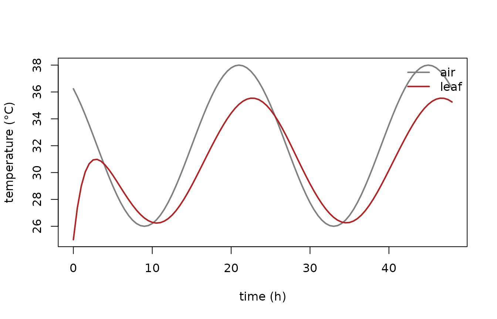
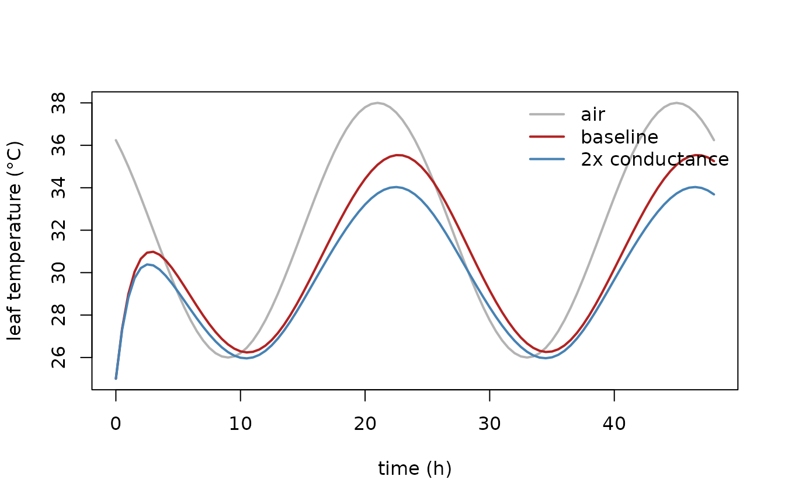

# Building your own model with external drivers

The [getting-started
vignette](https://traitecoevo.github.io/odelia/articles/odelia.md) uses
the Lorenz system, which ships compiled into the package. This article
shows the other half of the story: **how to define your own ODE system
in C++ and drive it with external, time-varying forcing.** It is the
workflow you would follow to use `odelia` in your own project.

We use a simple *leaf thermal model* — a single ODE for leaf temperature
that is forced by air temperature (an external driver) and cooled by
transpiration. The complete, copy-able sources live in the installed
package under
`system.file("examples/leaf_thermal", package = "odelia")`.

> This is a website-only article rather than a packaged vignette,
> because it compiles model-specific C++ at build time. That keeps the
> package’s cross-platform `R CMD check` fast and toolchain-light.

## Anatomy of an `odelia` model

A model that uses `odelia` is assembled from four files:

| File | Role |
|----|----|
| `src/leaf_thermal_system.hpp` | The **system**: a C++ class defining the ODE. |
| `src/leaf_thermal_interface.cpp` | An **Rcpp interface** exposing the system to R. |
| `R/leaf_thermal_interface.R` | **R6 wrappers** giving a friendly R API. |
| this article | A runnable demonstration. |

### The system contract

A system is a class templated on its scalar type `T` (so the same code
works with `double` and with the AD number type). It must implement a
small contract:

``` cpp
template <typename T = double>
class LeafThermalSystem {
public:
  // number of state variables
  size_t ode_size() const { return ode_dimension; }

  // read state in from an iterator (and refresh drivers/rates)
  template <typename Iterator>
  Iterator set_ode_state(Iterator it, double time_);

  // write the current state out to an iterator
  template <typename Iterator>
  Iterator ode_state(Iterator it) const;

  // write the current rates (dy/dt) out to an iterator
  template <typename Iterator>
  Iterator ode_rates(Iterator it) const;
};
```

Templating on `T` is what makes the system **AD-ready** — see the
[parameter-fitting
vignette](https://traitecoevo.github.io/odelia/articles/parameter-fitting.md).

### Drivers

External forcing enters through a `drivers::Drivers` object. The system
holds a reference to it and queries the current value on each step:

``` cpp
void initialize_drivers(const drivers::Drivers &drv);   // attach drivers
void set_drivers();                                     // query at current time
```

On the R side, `Drivers` fits a smooth cubic-spline interpolation
through a time series, so the system can be evaluated at any time the
adaptive stepper lands on. A `Drivers` object can hold several variables
and accepts any time grid that covers the simulation.

## Compile the model

Compiling a model interface requires the `odelia` headers on the include
path.
[`odelia_load_dll()`](https://traitecoevo.github.io/odelia/reference/odelia_load_dll.md)
makes the package’s compiled symbols available to the temporary shared
object that
[`Rcpp::sourceCpp()`](https://rdrr.io/pkg/Rcpp/man/sourceCpp.html)
builds.

``` r

library(odelia)
odelia_load_dll()

ex_dir <- system.file("examples/leaf_thermal", package = "odelia")

# Put the odelia headers on the include path for sourceCpp
Sys.setenv(PKG_CPPFLAGS = paste0("-I", system.file("include", package = "odelia")))

# Compile the model-specific interface, then load the R6 wrappers
Rcpp::sourceCpp(file.path(ex_dir, "src", "leaf_thermal_interface.cpp"), verbose = FALSE)
source(file.path(ex_dir, "R", "leaf_thermal_interface.R"))
```

## Define drivers and run

Here the air-temperature driver is a sinusoidal daily cycle over two
days.

``` r

# A daily temperature cycle
p <- list(Tmean = 32, Tamp = 6, tpeak = 15)
time_driver <- seq(0, 48, by = 0.25)
t_air <- p$Tmean + p$Tamp * sin(2 * pi * (time_driver - p$tpeak) / 24)

drivers <- Drivers$new()
drivers$set_variable("temperature", time_driver, t_air)

# Build the system with its parameters and drivers
pars <- LeafThermalSystemPars()
lz <- LeafThermalSystem$new(pars, drivers)
lz$set_state(c(25), 0) # initial leaf temperature, initial time

# Solve
ctrl <- OdeControl$new()
runner <- LeafThermalSolver$new(lz$ptr, ctrl$ptr, drivers$ptr)
times <- seq(0, 48, by = 0.5)
runner$advance_adaptive(times)

out <- runner$history()
out$time <- times
head(out)
#> # A tibble: 6 × 5
#>    time  T_LC T_air dT_LC   S_tr
#>   <dbl> <dbl> <dbl> <dbl>  <dbl>
#> 1   0    25    36.2 5.55  0.0759
#> 2   0.5  27.4  35.7 3.94  0.211 
#> 3   1    29.0  35   2.63  0.376 
#> 4   1.5  30.0  34.3 1.62  0.505 
#> 5   2    30.7  33.6 0.869 0.581 
#> 6   2.5  30.9  32.8 0.306 0.615
```

``` r

plot(out$time, out$T_air,
  type = "l", col = "grey50", lwd = 2,
  xlab = "time (h)", ylab = "temperature (°C)",
  ylim = range(out$T_air, out$T_LC)
)
lines(out$time, out$T_LC, col = "firebrick", lwd = 2)
legend("topright",
  legend = c("air", "leaf"),
  col = c("grey50", "firebrick"), lwd = 2, bty = "n"
)
```



The leaf temperature tracks the air temperature but is buffered by
transpirational cooling — exactly the behaviour we expect.

## Comparing strategies

Because building and running a system is cheap, comparing
parameterisations is just a loop. Here we double the maximum
transpiration conductance and re-run:

``` r

run_strategy <- function(g_tr_max) {
  pars <- LeafThermalSystemPars()
  pars$g_tr_max <- g_tr_max
  lz <- LeafThermalSystem$new(pars, drivers)
  lz$set_state(c(25), 0)
  runner <- LeafThermalSolver$new(lz$ptr, ctrl$ptr, drivers$ptr)
  runner$advance_adaptive(times)
  runner$history()$T_LC
}

base_g <- LeafThermalSystemPars()$g_tr_max
T_baseline <- run_strategy(base_g)
T_high_cond <- run_strategy(2 * base_g)

plot(times, out$T_air,
  type = "l", col = "grey70", lwd = 2,
  xlab = "time (h)", ylab = "leaf temperature (°C)",
  ylim = range(out$T_air, T_baseline, T_high_cond)
)
lines(times, T_baseline, col = "firebrick", lwd = 2)
lines(times, T_high_cond, col = "steelblue", lwd = 2)
legend("topright",
  legend = c("air", "baseline", "2x conductance"),
  col = c("grey70", "firebrick", "steelblue"), lwd = 2, bty = "n"
)
```



Higher conductance means stronger transpirational cooling, so the leaf
stays closer to — or below — air temperature at the hottest part of the
day.

## Where next

- The full, copy-able sources are in
  `system.file("examples/leaf_thermal", package = "odelia")` — start
  there when building your own model.
- To calibrate a model’s parameters against data using exact gradients,
  see the [parameter-fitting
  vignette](https://traitecoevo.github.io/odelia/articles/parameter-fitting.md).
