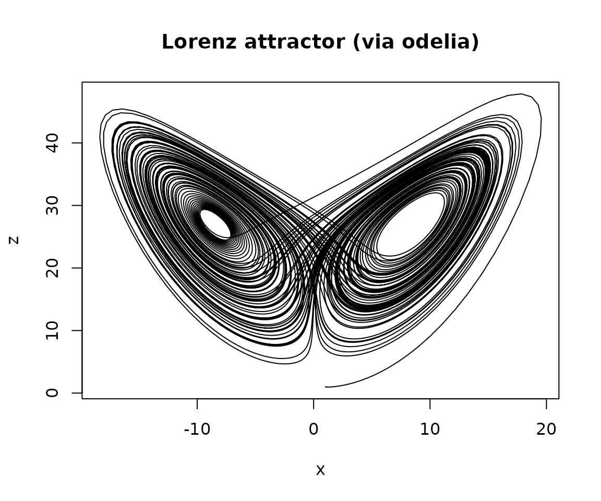

# Getting started with odelia

This vignette walks through the minimal setup for solving an ODE system
with `odelia`, using the classic [Lorenz
system](https://en.wikipedia.org/wiki/Lorenz_system) as the worked
example. The Lorenz system is built into the package, so everything
below runs against
[`library(odelia)`](https://github.com/traitecoevo/odelia) directly — no
C++ compilation needed.

``` r

library(odelia)
```

## The core abstractions

A simulation in `odelia` is assembled from a few pieces:

- a **system** — the ODE model itself (parameters, state, and a rule for
  the rates `dy/dt`);
- a **control** object (`OdeControl`) — the solver’s tolerances and step
  sizes;
- a **solver** (or *runner*) — which drives the adaptive RK4-5 stepper
  forward over the times you request and collects the solution history.

## Define the system

The Lorenz system has three state variables and three parameters
(`sigma`, `R`, `b`). We create it and set an initial state. The Lorenz
system is autonomous (its rates do not depend on time directly), so no
time is required.

``` r

lz <- LorenzSystem$new(sigma = 10, R = 28, b = 8 / 3)

# Inspect stored parameters
lz$pars()
#> [1] 10.000000 28.000000  2.666667

# Set the initial state (x, y, z)
lz$set_state(c(1, 1, 1))

# We can query the current state and rates directly
lz$state()
#> [1] 1 1 1
lz$rates()
#> [1]  0.000000 26.000000 -1.666667
```

## Solve the system

Create a control object (the defaults are sensible) and a solver, then
advance with adaptive time stepping over the times we want output at.

``` r

ctrl <- OdeControl$new()

runner <- Lorenz_Solver$new(lz$ptr, ctrl$ptr)
runner$advance_adaptive(seq(0, 100, by = 0.01))

out <- runner$history()
head(out)
#> # A tibble: 6 × 7
#>    time     x     y     z  dxdt  dydt    dzdt
#>   <dbl> <dbl> <dbl> <dbl> <dbl> <dbl>   <dbl>
#> 1  0     1     1    1      0     26   -1.67  
#> 2  0.01  1.01  1.26 0.985  2.47  26.1 -1.35  
#> 3  0.02  1.05  1.52 0.973  4.75  26.8 -0.997 
#> 4  0.03  1.11  1.80 0.965  6.91  28.1 -0.583 
#> 5  0.04  1.19  2.09 0.962  9.02  30.0 -0.0858
#> 6  0.05  1.29  2.40 0.964 11.1   32.4  0.520
```

[`history()`](https://rdrr.io/r/utils/savehistory.html) returns a tibble
with one row per requested output time. Because the stepper is adaptive,
the solver may take more internal steps than there are output rows — the
internal evaluation times are available via `runner$times()`.

## Plot the attractor

``` r

plot(out$x, out$z,
  type = "l",
  xlab = "x", ylab = "z",
  main = "Lorenz attractor (via odelia)"
)
```



## Controlling the solver

`OdeControl` exposes the solver’s tuning knobs — absolute/relative
tolerances, state and derivative scaling, and minimum/maximum/initial
step sizes. You can inspect the current settings or tighten them:

``` r

ctrl$get_controls()
#> $tol_abs
#> [1] 1e-08
#> 
#> $tol_rel
#> [1] 1e-08
#> 
#> $a_y
#> [1] 1
#> 
#> $a_dydt
#> [1] 0
#> 
#> $step_size_min
#> [1] 1e-08
#> 
#> $step_size_max
#> [1] 10
#> 
#> $step_size_initial
#> [1] 1e-06

# Tighten tolerances for a more accurate (but slower) solve
ctrl$set_tol_abs(1e-8)
ctrl$set_tol_rel(1e-8)
```

## Choosing an integration method

`odelia` ships three steppers, chosen with the `method` argument when
you create a solver:

- `"rkck"` (the default for a compiled system) — an explicit adaptive
  Cash-Karp Runge-Kutta 4(5) method. Fast and accurate for **non-stiff**
  problems like Lorenz.
- `"dopri"` — the explicit Dormand-Prince 5(4) pair, the method behind
  `deSolve`’s `ode45`, with a **dense output** of its own order: the
  state at any time inside a step, from the step’s own stages, at no
  extra evaluation. The default for a right-hand side written in R
  (below).
- `"rodas"` — an implicit, adaptive RODAS4(3) Rosenbrock method for
  **stiff** problems. Each step forms the Jacobian once (by automatic
  differentiation for a compiled system, or from the system’s own
  Jacobian hook) plus a handful of linear solves, so the step size is
  limited by accuracy rather than stability. On a stiff problem the
  explicit method is forced into tiny steps (or fails), while RODAS
  keeps large steps.

``` r

runner_stiff <- Lorenz_Solver$new(lz$ptr, ctrl$ptr, method = "rodas")
```

All three share the same adaptive step-size controller and `OdeControl`
tolerances, so you can switch between them without changing anything
else. The controller’s rule is itself a switch,
`OdeControl$set_controller()`: `"gsl"` (the default, odelia’s
long-standing rule) or `"hairer"` (the classical rule of Hairer’s codes
and `deSolve`, which rejects far fewer attempts; see the package NEWS
for 0.6.0).

To use `method = "rodas"` with your own C++ system, give it either a
`template<class U> System<U> rebind() const` method (a one-liner that
copies the system with its scalar type swapped) so its right-hand side
can be differentiated for the Jacobian, as the Lorenz example does, or
an `ode_jacobian(y, t, dydt, J)` method that fills the Jacobian itself –
the header `ode_jacobian.hpp` has `fd_jacobian()` for a one-line
finite-difference version. The implicit stepper currently runs on the
passive (non-AD) solver; differentiating a fit *through* RODAS is
planned (odelia issue \#36).

## Solving a system written in R

Everything above drives a system compiled in C++. From 0.6.0 the same
solver, with the same controller and all three steppers, also takes a
right-hand side written in R. There is nothing to compile:
[`ode_solve()`](https://traitecoevo.github.io/odelia/reference/ode_solve.md)
is shaped like
[`deSolve::ode()`](https://rdrr.io/pkg/deSolve/man/ode.html), so a
function written for deSolve runs unchanged, and returns a matrix with a
`time` column and one column per state variable.

``` r

lorenz_r <- function(t, y, p) {
  list(c(p[["sigma"]] * (y[2] - y[1]),
         y[1] * (p[["R"]] - y[3]) - y[2],
         y[1] * y[2] - p[["b"]] * y[3]))
}
pars <- c(sigma = 10, R = 28, b = 8 / 3)

out_r <- ode_solve(lorenz_r, y0 = c(x = 1, y = 1, z = 1),
                   times = seq(0, 2, by = 0.1), parms = pars,
                   autonomous = TRUE)
head(out_r)
#>      time         x         y         z
#> [1,]  0.0  1.000000  1.000000  1.000000
#> [2,]  0.1  2.133108  4.471421  1.113900
#> [3,]  0.2  6.542529 13.731189  4.180196
#> [4,]  0.3 16.684825 27.183509 26.206476
#> [5,]  0.4 15.366195  1.113016 46.757851
#> [6,]  0.5  1.198264 -8.867204 32.454742
```

The steps are the controller’s own, and the rows asked for are read off
each step’s dense output (`dense = TRUE`, the default under `"dopri"`),
so asking for ten thousand rows costs the same integration as asking for
ten. Under the other two steppers the interpolant is one order short of
the step, so there the default is `dense = FALSE`: a step is made to end
on every requested time, which is what `deSolve`’s `ode45` does and what
makes a fine output grid expensive there.

The implicit stepper needs the Jacobian of the right-hand side. Supply
it as `jacfunc(t, y, parms)`, an n by n matrix whose column j is the
derivative with respect to `y[j]`, or leave it out and it is formed by
forward differences at `n` extra evaluations per step.
[`ode_counts()`](https://traitecoevo.github.io/odelia/reference/ode_counts.md)
says what the solve cost, which for a right-hand side that is itself
expensive is the only number that matters:

``` r

lorenz_jac <- function(t, y, p) {
  matrix(c(-p[["sigma"]], p[["R"]] - y[3], y[2],
           p[["sigma"]], -1, y[1],
           0, -y[1], -p[["b"]]), 3, 3)
}
out_rodas <- ode_solve(lorenz_r, y0 = c(x = 1, y = 1, z = 1),
                       times = seq(0, 2, by = 0.1), parms = pars,
                       jacfunc = lorenz_jac, method = "rodas", autonomous = TRUE)
ode_counts(out_rodas)
#>        n_rhs        n_jac      n_steps n_rejections 
#>         1339          211          211           12
```

A stiff problem is where the implicit stepper earns its keep. Van der
Pol with a small `eps` forces the explicit stepper into thousands of
tiny steps for stability while RODAS stays accuracy-limited:

``` r

vdp <- function(t, y, eps) {
  list(c(y[2], ((1 - y[1]^2) * y[2] - y[1]) / eps))
}
times <- seq(0, 2, by = 0.2)
stiff_rodas <- ode_solve(vdp, c(2, 0), times, parms = 1e-4, method = "rodas", autonomous = TRUE)
stiff_dopri <- ode_solve(vdp, c(2, 0), times, parms = 1e-4, method = "dopri", autonomous = TRUE)
rbind(rodas = ode_counts(stiff_rodas), dopri = ode_counts(stiff_dopri))
#>       n_rhs n_jac n_steps n_rejections
#> rodas  7449   823     823          144
#> dopri 79939     0   11938         1385
```

Underneath
[`ode_solve()`](https://traitecoevo.github.io/odelia/reference/ode_solve.md)
is the R6 class `OdeSolver`, which is driven a step at a time. That is
what a caller with *events* needs: after each accepted step it can look
at the state, change it, and even change its length, before the next
step. The right-hand side here is `rhs(t, y)` returning the rates
directly, and a callback that finds its state impossible calls
[`domain_error()`](https://traitecoevo.github.io/odelia/reference/domain_error.md)
to have the step rejected and retried smaller rather than committed:

``` r

logistic <- function(t, y) {
  if (y[1] < 0 || y[1] > 1) domain_error("y has left [0, 1]")
  50 * y[1] * (1 - y[1])
}
s <- OdeSolver$new(logistic, y0 = 0.5, autonomous = TRUE)
while (s$time() < 1) {
  s$step(time_max = 1)
}
c(time = s$time(), y = s$state())
#> time    y 
#>    1    1
s$counts()
#>        n_rhs        n_jac      n_steps n_rejections 
#>         1343            0          143           99
```

Between steps `s$set_state(y, time)` re-seeds the state at any length
and `s$set_step_size(h)` carries a step size across it;
`s$advance_collect(times)` is the output loop of
[`ode_solve()`](https://traitecoevo.github.io/odelia/reference/ode_solve.md),
a matrix of states at the times asked for.

Each stage of a step is one call into R, so for a cheap right-hand side
this runs at the speed of the R function and the call into it, which is
the speed `deSolve` runs an R function at too (on Lorenz, 0.95 µs a call
here against 1.03 µs there, with the R function itself 0.6 µs of each).
What makes odelia faster on a fine output grid is the dense output:
`deSolve::ode45` lands a step on every requested time, odelia does not
have to. Lorenz to t = 100 at 1e-6 with 10001 rows takes 27 ms here
against 62 ms for `ode45` and 33 ms for `lsoda`, with the same R
function and the same accuracy against a tight reference. The compiled
route above is a hundred times faster still, because nothing crosses
into R per stage. For a right-hand side that is itself a large
computation the solver’s own cost is nothing, and what
[`ode_counts()`](https://traitecoevo.github.io/odelia/reference/ode_counts.md)
reports is the whole cost of the integration.

## Where next

- For models with **external time-varying forcing**, and how to define
  your own ODE system in C++, see [Building your own model with external
  drivers](https://traitecoevo.github.io/odelia/articles/leaf-thermal.html).
- To recover parameters from data using exact gradients, see
  [`vignette("parameter-fitting", package = "odelia")`](https://traitecoevo.github.io/odelia/articles/parameter-fitting.md).
